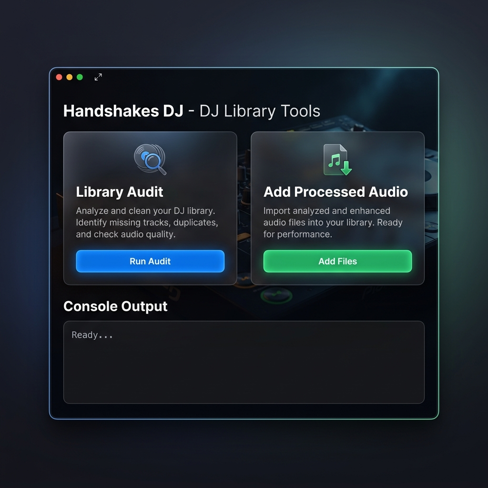

# Handshakes DJ - DJ Library Tools

This repository contains a collection of PowerShell and Python scripts designed to automate, clean up, and synchronize a DJ library (Rekordbox and Serato). 

These scripts help in:
- **Library Auditing**: Finding exact audio duplicates, chromaprint (acoustic) overlap, and orphaned metadata.
- **Metadata Management**: Normalizing tags, adding missing files to Rekordbox, and cleaning up filenames (e.g., removing `_processed` suffixes after using Audio Processor).
- **Synchronization**: Syncing smart playlists, relinking mounted drive paths, and matching your local library against streaming platform availability (e.g., TIDAL, Spotify).
- **Genre taxonomy playlists**: Auditing genre aliases and materializing safe Rekordbox genre buckets, subgenres, and BPM-sorted normal playlists.
- **Quality Control**: Measuring audio quality and verifying readiness of your tracks.

## Prerequisites

- **Python 3.x**: Ensure Python is installed.
- **PowerShell 7+**: Many entry point scripts are `.ps1`.
- **Dependencies**: You might need modules like `mutagen`, `requests`, `pyacoustid` (if using chromaprint features), and SQLite drivers for Rekordbox databases. Check the Python files for imports.

## Setup & Configuration

To adapt these scripts to your own setup, you must configure your paths.
Most scripts take arguments like `-MusicRoot` or `--music-root`. Alternatively, you can create a `config/paths.json` (if your fork implements it) or modify the default arguments in the scripts directly.

**Default Path Placeholders used in these scripts:**
- `C:\DJ_Music`: The root directory of your DJ library.
- `C:\DJ_Music\Processed_Library_Root`: The directory containing tracks processed by tools like Audio Processor.
- `C:\DJ_Music\Playlists\ALL_TRACKS`: The directory containing your main playlist exports.
- `C:\DJ_Music\_DUPLICATE_QUARANTINE`: Where duplicates are moved.

## Structure

- **`scripts/`**: Contains all the automation logic.
  - `.ps1` files: Main entry points and task runners.
  - `.py` files: Core logic, database interactions, and metadata processing.
  - `.js` files: Scripts for integrations like OneTagger.
- **`ui/`**: A modern Tauri frontend providing a simple visual interface to run scripts.
- **`docs/`**: Technical documentation.
  - [`USB_MIDI_MAPPING_GUIDE.md`](docs/USB_MIDI_MAPPING_GUIDE.md): Guide on reverse-engineering proprietary USB controllers (like the XDJ-AERO) into standard Windows MIDI.

## Usage (Graphical Interface)



You can use the provided graphical interface to run scripts without the command line.

### For Non-Coders (Install via Download)

1. Go to the [Releases page](https://github.com/NathanOtano/handshakes-dj-library-tools/releases) on GitHub.
2. Download the latest `HandshakesDJLibraryTools_x.x.x_x64_en-US.msi` file.
3. Run the installer and open the application from your Start Menu.

### For Developers (Run Locally)

1. **Install Rust**: You must install [Rust](https://rustup.rs/) to compile the UI.
2. **Install Node.js**: Required to install frontend dependencies.
3. **Run the UI**:
   ```powershell
   cd ui
   npm install
   npm run tauri dev
   ```

## Usage Examples (Command Line)

Most tools are designed to have a "Dry-run" or "Plan" mode first.

**Audit your library for duplicates:**
```powershell
pwsh -NoProfile -File .\scripts\Audit-DjLibraryCleanup.ps1 -AudioRoot "C:\DJ_Music" -AudioHashMode none -Json
```

**Add newly processed files to Rekordbox:**
```powershell
pwsh -NoProfile -File .\scripts\Add-RekordboxProcessedContent.ps1 -Mode Plan -DuplicateCsv reports\local-duplicate-candidates.csv
```

**Audit and materialize Rekordbox genre taxonomy playlists:**
```powershell
Copy-Item .\config\dj-genre-taxonomy.json.example .\config\dj-genre-taxonomy.json
pwsh -NoProfile -File .\scripts\Audit-RekordboxGenreTaxonomy.ps1 -Json
pwsh -NoProfile -File .\scripts\Sync-RekordboxGenreTaxonomy.ps1 -Mode Plan -Json
pwsh -NoProfile -File .\scripts\Sync-RekordboxGenreTaxonomy.ps1 -Mode CopyApply -Apply -Json
```

> **Warning**: Modifying the Rekordbox `master.db` directly carries risks. Always ensure Rekordbox is closed and you have backups before running scripts with `-Apply` flags.

## Legal & Copyright Disclaimer

> [!WARNING]
> **Use at Your Own Risk.** These scripts interact directly with Rekordbox/Serato SQLite databases and file systems. Incorrect use **can corrupt your library**. Always back up your `master.db` and your audio files before running any destructive operations (like duplicate removals or relinking).

**1. Personal Use Only & Copyright**
This project is intended strictly for personal, private management of **legally acquired** audio files (e.g., purchases, legal promos, record pools). 
- This repository **does not** contain or distribute copyrighted audio files.
- The author does not endorse, encourage, or facilitate the unauthorized downloading, ripping, or distribution of copyrighted material. Any scripts interfacing with third-party APIs (like Spotify or TIDAL) are meant solely for metadata matching and library coverage auditing.

**2. Terms of Service**
Users are responsible for ensuring that their use of these scripts complies with the Terms of Service of any third-party software, streaming platform, or API they interact with.

**3. Trademarks & Affiliation**
- **Rekordbox** and **Pioneer DJ** are trademarks of AlphaTheta Corporation.
- **Serato** is a trademark of Serato Limited.
- **Spotify**, **TIDAL**, **Audio Processor**, and **OneTagger** are trademarks of their respective owners.
- This project is **100% unofficial and independent**. It is not affiliated with, sponsored by, or endorsed by AlphaTheta, Pioneer DJ, Serato, or any other mentioned brand. All trademarks belong to their respective owners.
